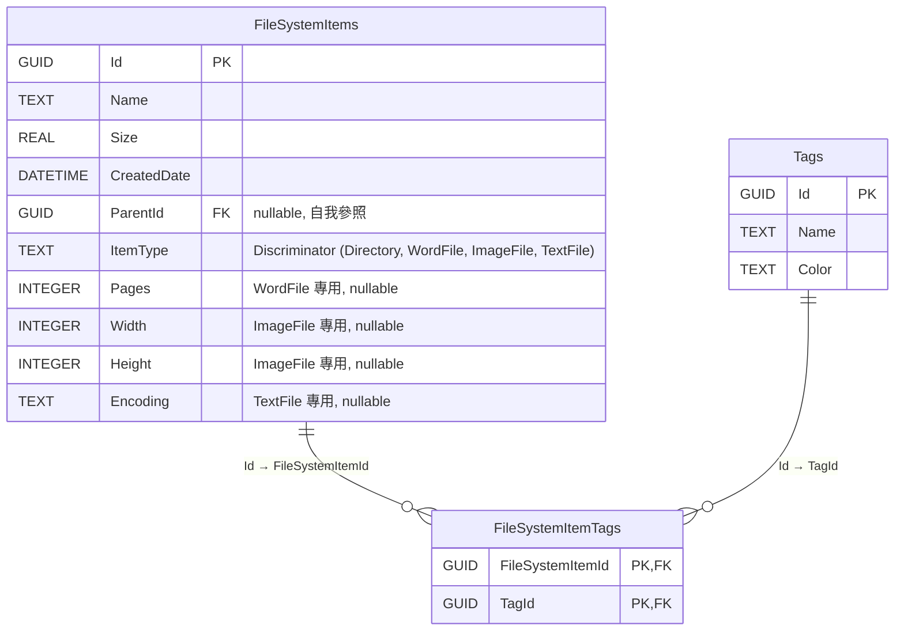

```mermaid
erDiagram
    FileSystemItems {
        GUID Id PK
        TEXT Name
        REAL Size
        DATETIME CreatedDate
        GUID ParentId FK "nullable, 自我參照"
        TEXT ItemType "Discriminator (Directory, WordFile, ImageFile, TextFile)"
        INTEGER Pages "WordFile 專用, nullable"
        INTEGER Width "ImageFile 專用, nullable"
        INTEGER Height "ImageFile 專用, nullable"
        TEXT Encoding "TextFile 專用, nullable"
    }

    Tags {
        GUID Id PK
        TEXT Name
        TEXT Color
    }

    FileSystemItemTags {
        GUID FileSystemItemId PK, FK
        GUID TagId PK, FK
    }

    FileSystemItems ||--o{ FileSystemItemTags : "Id → FileSystemItemId"
    Tags ||--o{ FileSystemItemTags : "Id → TagId"
```
