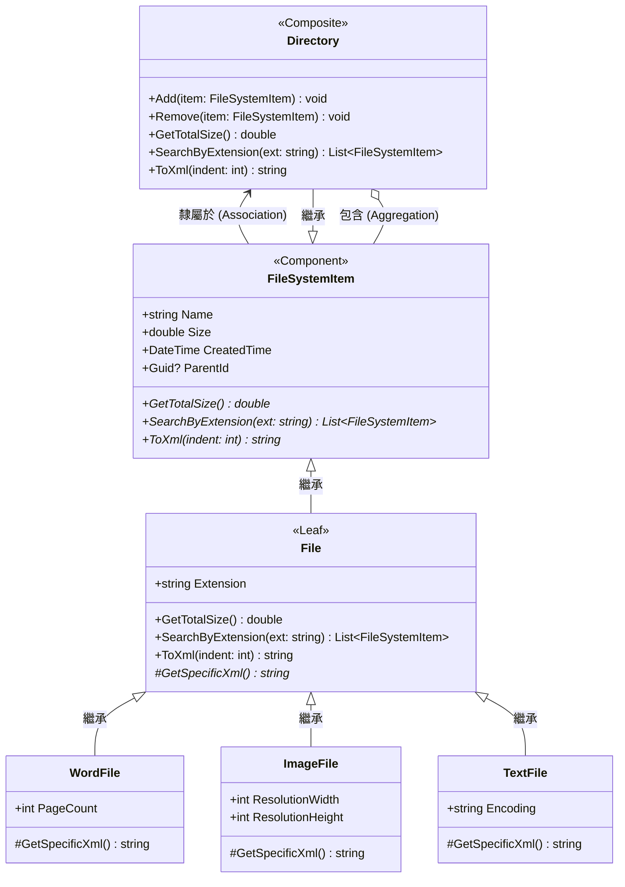

```mermaid
classDiagram
    direction BT

    %% 定義類別與介面
    class FileSystemItem {
        <<Component>>
        +string Name
        +double Size
        +DateTime CreatedTime
        +Guid? ParentId
        +GetTotalSize()* double
        +SearchByExtension(ext: string)* List~FileSystemItem~
        +ToXml(indent: int)* string
    }

    class Directory {
        <<Composite>>
        +Add(item: FileSystemItem) void
        +Remove(item: FileSystemItem) void
        +GetTotalSize() double
        +SearchByExtension(ext: string) List~FileSystemItem~
        +ToXml(indent: int) string
    }

    class File {
        <<Leaf>>
        +string Extension
        +GetTotalSize() double
        +SearchByExtension(ext: string) List~FileSystemItem~
        +ToXml(indent: int) string
        #GetSpecificXml()* string
    }

    class WordFile {
        +int PageCount
        #GetSpecificXml() string
    }

    class ImageFile {
        +int ResolutionWidth
        +int ResolutionHeight
        #GetSpecificXml() string
    }

    class TextFile {
        +string Encoding
        #GetSpecificXml() string
    }

    %% 定義繼承關係 (Inheritance)
    Directory --|> FileSystemItem : 繼承
    File --|> FileSystemItem : 繼承
    WordFile --|> File : 繼承
    ImageFile --|> File : 繼承
    TextFile --|> File : 繼承

    %% 定義聚合與關聯關係
    Directory o-- FileSystemItem : 包含 (Aggregation)
    FileSystemItem --> Directory : 隸屬於 (Association)
```
